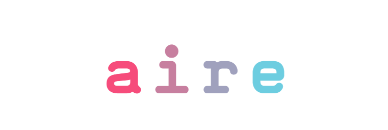

# aire



Realtime polls at the edge. Create a yes/no poll, share the link, watch votes update live.

**Live:** https://jvoltci.github.io/aire/
**API:** https://aire-api.altrusian.workers.dev

## Stack

- **React 19** + **TypeScript** + **Vite 6**
- **Tailwind CSS 4**, imported granularly so [nilam](https://jvoltci.github.io/nilam/)
  sits between Tailwind's `base` and `utilities` layers
- **nilam** for colour, solved at aire's own measured brand hue of **219.5** rather than
  nilam's signature 285 — see the header comment in `src/index.css` for the reasoning and
  what the move cost. Regenerate the palette with
  `npx nilam 219.5 --css=src/nilam.tokens.aire.css`
- **Light and dark**, both driven from `color-scheme` and `light-dark()`, so there is one
  token block and no `dark:` variants
- **HashRouter** (GitHub Pages SPA-friendly)
- Native **WebSocket** + auto-reconnect
- Backend lives in [aire-api](https://github.com/jvoltci/aire-api): Cloudflare Worker + Durable Object + D1

## Run locally

```bash
npm install
npm run dev          # http://localhost:5173
```

Override the API URL with an env var if you want to point at a local worker:

```bash
echo 'VITE_API_URL=http://127.0.0.1:8787' > .env.local
npm run dev
```

## Build

```bash
npm run build        # outputs to dist/
npm run preview      # serve the built dist/ locally
```

## Deploy

Pushing to `master` auto-deploys to GitHub Pages via the workflow in
[.github/workflows/deploy.yml](.github/workflows/deploy.yml).

**One-time setup:** in the repo on GitHub, go to
**Settings → Pages → Build and deployment → Source** and select **GitHub Actions**.

## Project layout

```
src/
├── main.tsx              # entry
├── index.css             # cascade layers, nilam imports, the three local rules
├── nilam.tokens.aire.css # GENERATED by `npx nilam 219.5` — do not hand-edit
├── components/
│   ├── Shell.tsx         # layout, skip link, header/footer
│   ├── Bar.tsx           # one yes/no tally row as an .n-meter
│   └── PollSkeleton.tsx  # the .n-skeleton loading state for Vote and Results
├── routes/
│   ├── Home.tsx          # create a poll
│   ├── Vote.tsx          # cast a vote
│   └── Results.tsx       # live results
└── lib/
    ├── api.ts            # REST client
    ├── ws.ts             # WebSocket with reconnect + ping
    ├── env.ts            # API base URL
    └── voter.ts          # voter id in localStorage (dedupe)
```
